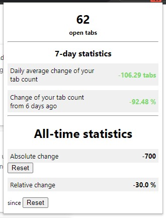

I used this project to learn JavaScript and Chrome add-ons. This project is incomplete and unpolished.

This is a small Chrome add-on for people like me who have too many tabs open in their Chrome browser and keep opening more every day and want
to unlearn this behavior. It shows you the number of tabs you opened/closed that day as a small number on the icon in your add-on bar. 
Clicking on it shows a few more statistics like the current number of tabs open, how many tabs you opened/closed in the last 7 days and all-time.

Screenshot:

